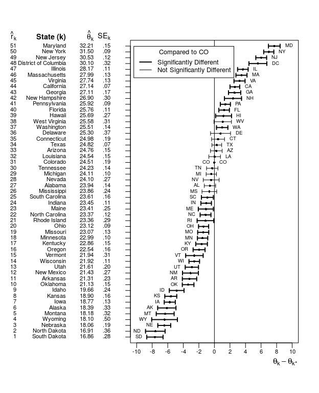

<!-- README.md is generated from README.Rmd. Please edit that file -->

# The Ranking Project: Visualizations for Comparing Populations

The package `RankingProject` is a companion for the article “A Primer on
Visualizations for Comparing Populations, Including the Issue of
Overlapping Confidence Intervals” (Wright, Klein, and Wieczorek, 2019,
*The American Statistician*) and “A Joint Confidence Region for an
Overall Ranking of Populations” (Klein, Wright, and Wieczorek, 2020,
*Journal of the Royal Statistical Society: Series C*, in press).

The package provides functions for plotting ranked tables of data
side-by-side with their plots. The available visualizations include
shaded columns plots, adjusted confidence intervals, and related plots
intended for making correct inferences about one-to-many or many-to-many
comparisons.

## Installation

``` r
# install.packages("devtools")
# library("devtools")
install_github("civilstat/RankingProject")
```

To install the vignettes and exactly replicate figures from the paper,
you will also need the `tikzDevice` package:

``` r
# install.packages("tikzDevice")
install_github("civilstat/RankingProject", build_vignettes = TRUE)
```

## Example

``` r
library(RankingProject)

# Load dataset of mean travel time (in minutes) to work
# of workers 16 years and over who did not work at home,
# from the 2011 American Community Survey (ACS)
data(TravelTime2011)
USdata <- TravelTime2011
head(USdata)
#>   Rank        State Estimate.2dec SE.2dec Abbreviation  Region FIPS
#> 1    1 South Dakota         16.86    0.28           SD MIDWEST   46
#> 2    2 North Dakota         16.91    0.36           ND MIDWEST   38
#> 3    3     Nebraska         18.06    0.19           NE MIDWEST   31
#> 4    4      Wyoming         18.10    0.50           WY    WEST   56
#> 5    5      Montana         18.18    0.32           MT    WEST   30
#> 6    6       Alaska         18.39    0.33           AK PACIFIC    2

# Format estimates and SEs into strings with 2 digits past the decimal
USdata$Estimate.Print = formatC(USdata$Estimate.2dec,
                                format = 'f', digits = 2)
# For SEs, also drop the leading 0
USdata$SE.Print = substring(formatC(USdata$SE.2dec,
                                    format = 'f', digits = 2),
                            first = 2)

# Set Colorado as the reference area
refAbbr <- "CO"
refRow  <- which(USdata$Abbreviation==refAbbr)

# Set up parameter lists for table function and plot function
tableParList <- with(USdata,
                     list(ranks = Rank, names = State,
                          est = Estimate.Print, se = SE.Print,
                          placeType = "State"))
plotParList <- with(USdata,
                      list(est = Estimate.2dec, se = SE.2dec,
                           names = Abbreviation, refName = refAbbr,
                           confLevel = .9, cex = 0.6, thetaLine = 1.5,
                           plotType = "difference", lwdBold = 2))

# Plot demi-Bonferroni-corrected 90% CIs
# for the differences between Colorado and each other state,
# alongside a ranking table
RankPlotWithTable(tableParList = tableParList, plotParList = plotParList)
```

<!-- -->

## References

Almond, R.G., Lewis, C., Tukey, J.W., and Yan, D. (2000). “Displays for
Comparing a Given State to Many Others,” *The American Statistician*,
vol. 54, no. 2, 89-93, <DOI:10.1080/00031305.2000.10474517>.

Klein, M., Wright, T., and Wieczorek, J. (2020). “A Joint Confidence
Region for an Overall Ranking of Populations,” *Journal of the Royal
Statistical Society: Series C*, in press.

Wright, T., Klein, M., and Wieczorek, J. (2019). “A Primer on
Visualizations for Comparing Populations, Including the Issue of
Overlapping Confidence Intervals,” *The American Statistician*, vol. 73,
no. 2, 165-178, <DOI:10.1080/00031305.2017.1392359>.
